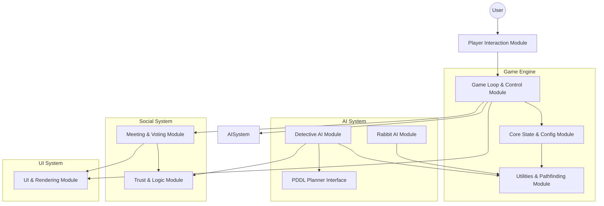
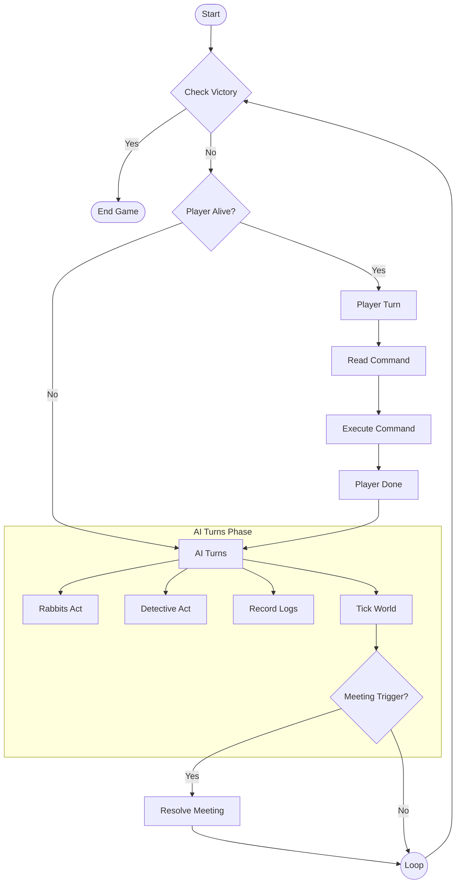

# TuFox Prolog Adventure

This project implements the **《兔狐绝杀》** inspired text adventure in SWI-Prolog, including a planner-driven detective rabbit adversary and PDDL assets. Start the game by running:

```bash
swipl -s tufox.pl -g start
```

The game launches automatically and prints the available commands:
- `move(Direction).` move up/down/left/right on the map
- `look.` describe current room
- `status.` show game status (round, tasks, cooldowns, map)
- `kill(Target).` eliminate a rabbit in this room (3-round cooldown)
- `wait.` end your action
- `show_rabbits.` toggle rabbit visibility on map
- `show_tasks.` toggle task visibility on map
- `use_planner.` toggle external PDDL planner for detective
- `show_pddl.` toggle visibility of PDDL planned actions
- `quit.` exit the session

## Game Mechanics
- **Role**: You are the Fox. Your goal is to eliminate all rabbits until only one remains.
- **Detective**: A special AI character that investigates identities. If the detective inspects you, you lose.
- **Tasks**: Rabbits perform tasks. If all tasks are completed, the rabbits win.
- **Meetings**: Triggered when a body is found or periodically (every 8 rounds).
- **Trust System**: AI characters maintain trust scores for each other based on statement validation during meetings.
- **Voting**: Characters vote to eliminate suspects based on trust scores.
- **Kill Restrictions**: You cannot kill the detective. You cannot kill if there are too many witnesses (unless total survivors <= 3).

## Files
- `tufox.pl` – main game logic, knowledge base, AI turns, meeting system, and planner integration.
- `adversary_domain.pddl` – STRIPS domain describing movement and identity inspection for the detective.
- `adversary_problem.pddl` – default problem instance used by the detective plan.

If `pyperplan` is available in your environment, the detective attempts to build a plan from the PDDL files. Otherwise, a built-in fallback plan is executed.

## System Architecture



## Game Loop Flow

